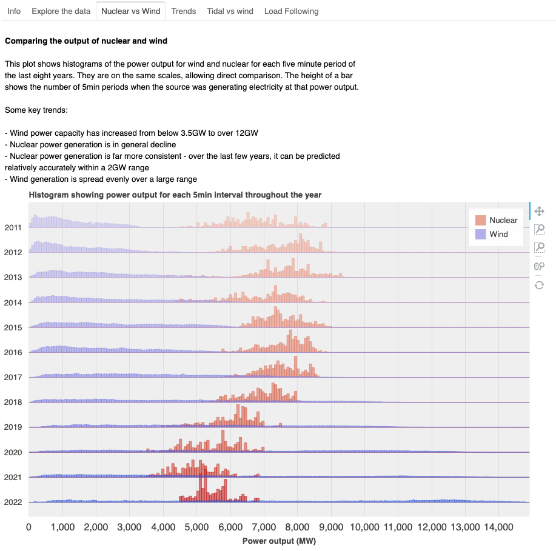
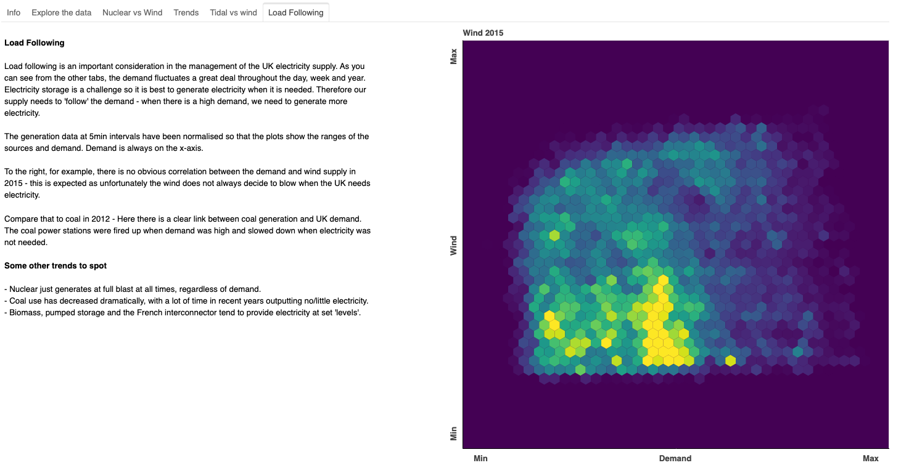
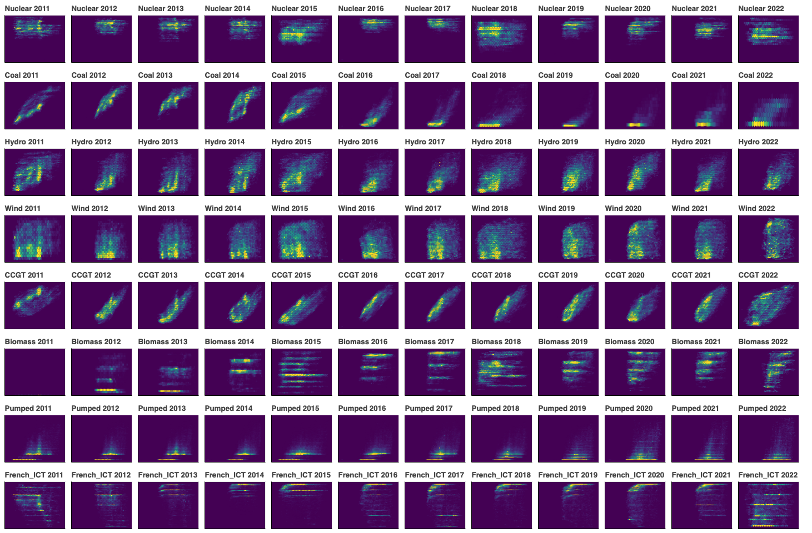

# ElectricityGeneration

Analysing the electricity generation of the UK from various sources

### Before running:
One data source is too large to be held on GitHub (csv file ~100MB)
To download it, go to https://www.gridwatch.templar.co.uk/download.php and press 'download', ensuring that all sources are selected (they are by default).
Store the resulting 'gridwatch.csv' file in the same location as the code to run.
Developed using Python 3.6.8

### to run:  
install the requirements  
`bokeh serve --show --port 5001 panels.py`

All other relevant csv files should be in this repo. They are stored here because they either do not have direct links online or have been modified to a format suitable to be read.

Note that the first run will take longer (~5mins total), but will create 'LF.csv' which will save time in future runs

     
  
### Example screenshots

